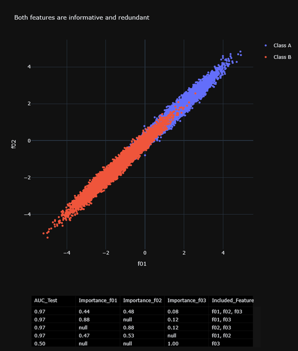

# Can we really rank features according to their importance?

This small codebase is primarily didactic. 
Researchers for whom I work as data scientist often wish a ranking of feature importance. 
So here I provide some intuitively appealing visuals to explain this. 
Three scenarios are briefly shown in this readme, but many more can be assessed by running the code.

**ML SUMMARY:**

Synthetic datasets for supervised classification are created with one binary class (the target) and 3 continuous features (the predictors).
The first two features can be informative for classification, while the third is always totally non-informative.
How the first two features inform classification can be actively chosen (e.g. see scenarios below).
Random Forest classifiers are trained for 'all 3 features' and for smaller subsets of the features.
The predictive performance (ROC-AUC) is obtained from a test set and the **impurity-based feature importance** is computed.
All this is summarized on plots that allow to explain the strengths and limitations of **impurity-based feature importance**.

**ILLUSTRATION:**

**Figure 1:** 
Scenario that most people have in mind: Both features are almost independent and both are informative.
Removing f01 or f02 reduces predictive performance only a bit.
**Figure 2:** 
Both feature are equally informative but highly redundant.
Removing f01 or f02 hardly affects predictive performance.
**Figure 3:** 
Information for classification is jointly shared among both features (i.e they are complementary).
Removing f01 or f02 kills predictive performance (AUC drops to almost 0.50).

**TAKE HOME MESSAGE:**

In all 3 scenarios the feature importance of the full model is very similar, approx. (0.45, 0.45, 0.10).
However, the impact of removing f01 or f02 is very different!
Thinking of individual feature importance does often not make sense
It is better to focus on feature sets and how they affect predictive performance (e.g. Test AUC)

**Figure 1**

**Figure 2**

**Figure 3**

**DEPENDENCIES:**
* Developed under Python 3.12.8
* First make a venv, then:
* pip install -r requirements.txt

**USAGE:**
* There is only one script **main.py** meant for interactive use.
* Several scenarios can be defined in the dict at the top of the script
* note that a few helper functions are imported from **utils.py**

**APPENDIX:**

Some additional didactically interesting scenarios are previewed here

